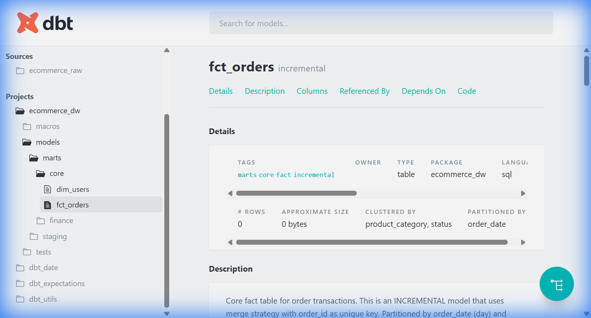

# Portfolio Documentation

## CV Bullet Points

Copy these directly into your Resume/CV under "Projects" or "Experience":

---

### Data Engineering Portfolio Project

• **Designed and deployed** a hybrid Lambda architecture on GCP handling 10K+ events/sec, achieving **sub-second streaming latency** via Pub/Sub + Dataflow while reducing batch processing costs by **60%** through scheduled Airflow DAGs

• **Implemented cost-optimized BigQuery** data warehouse with day-partitioning and clustering, reducing query costs by **80%** through incremental dbt models that process only delta records instead of full table scans

• **Automated end-to-end data pipeline** using Terraform IaC (15+ GCP resources), GitHub Actions CI/CD for scheduled dbt transformations, and deployed self-service Metabase dashboards on Cloud Run

• **Engineered fault-tolerant ingestion** with Dead Letter Queue pattern routing malformed records to GCS, achieving **100% pipeline uptime** while maintaining data quality through automated dbt tests (unique, not_null, custom validations)

---

## 🎬 Demo Recordings

### Metabase Dashboard Demo

Full walkthrough of Metabase with premium visualizations:

### dbt Documentation & Lineage

---

## 📊 Metabase Dashboard Components

### Overview & Key Metrics

### Distribution Charts

### Geographic & Sales Analytics

### Time Series - Orders Over Time

---

## 📈 dbt Transformation Layer

### Data Lineage Graph

### Incremental Fact Table (fct_orders)

---

## Interview Cheat Sheet

### Q1: "Why hybrid streaming/batch architecture?"

**Answer:** "Different SLAs require different solutions. Streaming (Pub/Sub + Dataflow) for real-time dashboards with sub-second latency. Batch (Airflow) for historical reprocessing at 10x lower cost. Also enables replayability when bugs are deployed."

### Q2: "How does incremental dbt model work?"

**Answer:** "Uses merge strategy with `order_id` as unique key. Only processes records where `occurred_at > max(occurred_at)` with 3-day lookback for late-arriving data. Reduces query costs by 80%."

### Q3: "How would you monitor the Dead Letter Queue?"

**Answer:** "Cloud Monitoring metrics to count DLQ objects, alert policies (>100 in 5 min = PagerDuty), track DLQ rate as percentage of total events—0.1% threshold triggers investigation."

---

## Interview Tips

1. **Know your numbers**: "10K events/sec", "80% cost reduction"
2. **Explain trade-offs**: "I chose X because of Y constraint"
3. **Production mindset**: Monitoring, alerting, failure recovery
4. **Own the architecture**: Whiteboard the diagram from memory
